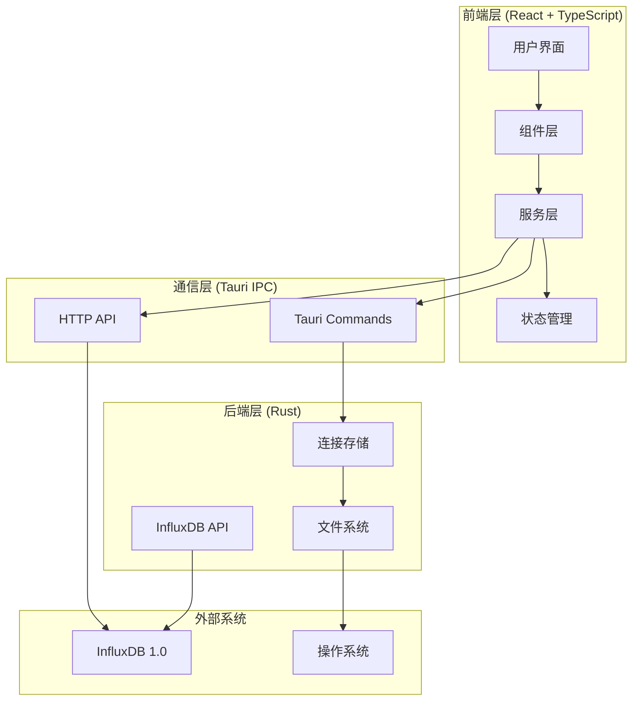
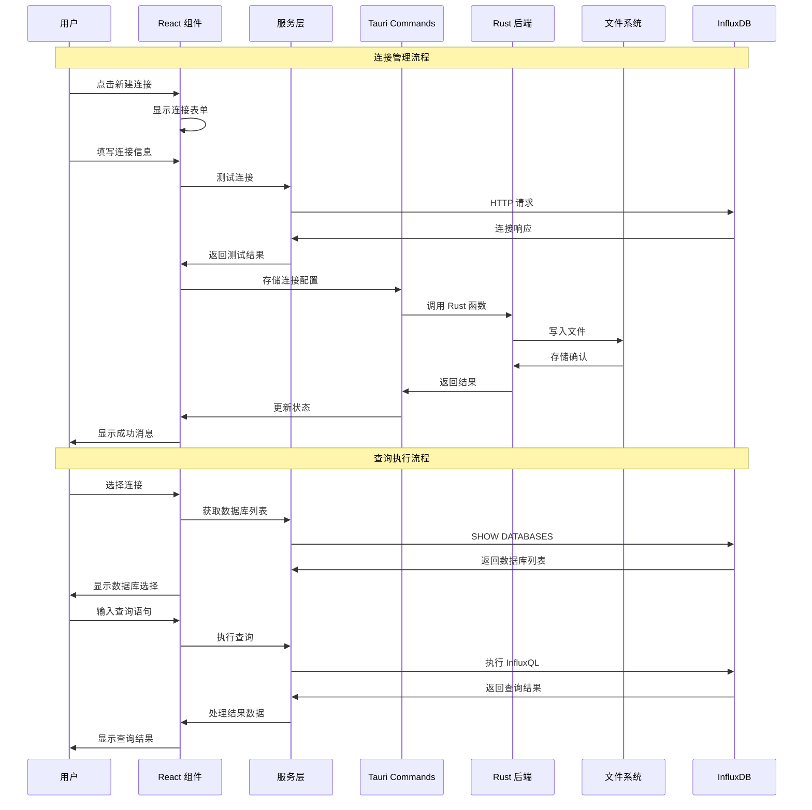
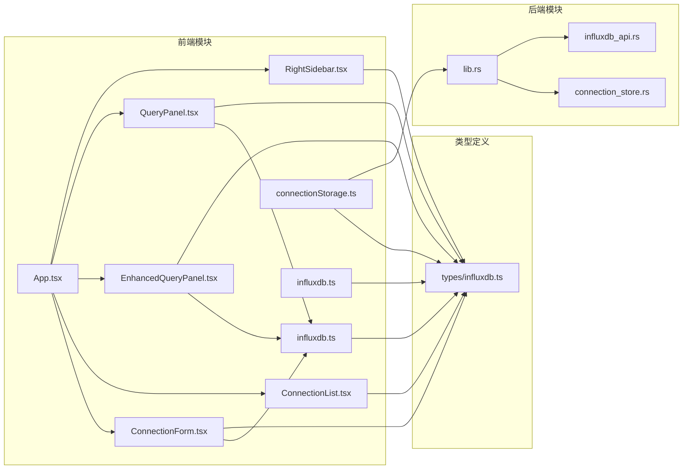

# InfluxDB UI 技术架构分析文档

## 项目概述

InfluxDB UI 是一个基于 Tauri 构建的桌面应用程序，专门用于管理 InfluxDB 1.0 数据库。该项目采用 Rust + TypeScript/React 技术栈，提供了直观的图形界面来连接、查询和管理 InfluxDB 数据库。

## 1. 项目整体架构概览

### 1.1 技术栈组成

#### 前端技术栈
- **框架**: React 18.3.1 + TypeScript 5.6.2
- **UI 组件库**: Ant Design 5.26.7
- **HTTP 客户端**: Axios 1.11.0
- **构建工具**: Vite 6.0.3
- **图表库**: Chart.js 4.5.0 + react-chartjs-2 5.3.0
- **图标库**: @ant-design/icons 6.0.0

#### 后端技术栈
- **桌面框架**: Tauri 2.x
- **编程语言**: Rust (Edition 2021)
- **异步运行时**: Tokio 1.x
- **数据库驱动**: influxdb-rust 0.6.0
- **序列化**: serde + serde_json
- **文件系统**: directories 5.0
- **时间处理**: chrono 0.4

### 1.2 项目结构

```
influxdb-ui/
├── src/                        # 前端源代码
│   ├── components/             # React 组件
│   │   ├── ConnectionForm.tsx   # 连接配置表单
│   │   ├── ConnectionList.tsx   # 连接列表
│   │   ├── EnhancedQueryPanel.tsx # 增强查询面板
│   │   ├── QueryPanel.tsx       # 基础查询面板
│   │   └── RightSidebar.tsx     # 右侧边栏
│   ├── services/               # 服务层
│   │   ├── influxdb.ts         # InfluxDB API 服务
│   │   └── connectionStorage.ts # 连接存储服务
│   ├── types/                  # TypeScript 类型定义
│   │   └── influxdb.ts         # InfluxDB 相关类型
│   ├── App.tsx                 # 主应用组件
│   ├── main.tsx                # 应用入口
│   └── *.css                   # 样式文件
├── src-tauri/                  # Tauri 后端
│   ├── src/                    # Rust 源代码
│   │   ├── main.rs             # 程序入口
│   │   ├── lib.rs              # Tauri 库入口
│   │   ├── influxdb_api.rs     # InfluxDB API 实现
│   │   └── connection_store.rs  # 连接存储实现
│   ├── Cargo.toml              # Rust 依赖配置
│   └── tauri.conf.json         # Tauri 配置
├── package.json                # 前端依赖配置
├── vite.config.ts              # Vite 配置
└── tsconfig.json               # TypeScript 配置
```

## 2. 代码文件依赖关系

### 2.1 前端依赖关系图

```
main.tsx
    └── App.tsx
        ├── components/
        │   ├── ConnectionList.tsx
        │   │   └── types/influxdb.ts
        │   ├── ConnectionForm.tsx
        │   │   ├── services/influxdb.ts
        │   │   └── types/influxdb.ts
        │   ├── EnhancedQueryPanel.tsx
        │   │   ├── services/influxdb.ts
        │   │   └── types/influxdb.ts
        │   ├── QueryPanel.tsx
        │   │   ├── services/influxdb.ts
        │   │   └── types/influxdb.ts
        │   └── RightSidebar.tsx
        └── services/
            ├── influxdb.ts
            │   └── types/influxdb.ts
            └── connectionStorage.ts
                └── types/influxdb.ts
```

### 2.2 后端依赖关系图

```
main.rs
    └── lib.rs
        ├── influxdb_api.rs
        │   ├── influxdb (crate)
        │   ├── chrono (crate)
        │   └── serde (crate)
        └── connection_store.rs
            ├── serde (crate)
            ├── directories (crate)
            └── std::fs
```

### 2.3 跨语言依赖关系

```
前端 (TypeScript)
    └── Tauri Commands
        └── 后端 (Rust)
            └── 系统文件存储
```

## 3. 功能模块调用逻辑

### 3.1 连接管理模块

#### 3.1.1 连接创建流程
1. **用户操作**: 用户点击"新建连接"按钮
2. **表单展示**: `ConnectionForm.tsx` 渲染连接配置表单
3. **数据验证**: 表单验证连接参数的完整性
4. **连接测试**: 调用 `influxdbService.testConnection()` 测试连接
5. **存储连接**: 通过 `connectionStorage.storeConnection()` 保存连接配置
6. **UI更新**: 更新连接列表和当前连接状态

#### 3.1.2 连接存储机制
- **生产环境**: 使用 Tauri Commands 调用 Rust 后端存储到文件系统
- **开发环境**: 降级使用 localStorage 进行本地存储
- **存储位置**: `~/.config/influxdb-ui/connections.json` (系统配置目录)

### 3.2 数据库查询模块

#### 3.2.1 查询执行流程
1. **连接选择**: 用户选择已配置的数据库连接
2. **数据库发现**: 自动获取数据库列表和 measurements
3. **查询编写**: 用户在查询编辑器中编写 InfluxQL
4. **查询执行**: 调用 `influxdbService.executeQuery()` 执行查询
5. **结果展示**: 将查询结果以表格形式展示

#### 3.2.2 增强功能
- **多标签页**: 支持同时进行多个查询
- **查询模板**: 提供常用的 InfluxQL 查询模板
- **结果导出**: 支持将查询结果导出为 CSV 格式
- **执行统计**: 显示查询执行时间和返回行数

### 3.3 数据流架构

#### 3.3.1 应用层数据流
```
用户操作 → React 组件 → 服务层 → HTTP API → InfluxDB
    ↓
状态管理 ← UI 更新 ← 数据处理 ← 响应解析 ← HTTP 响应
```

#### 3.3.2 连接配置数据流
```
用户输入 → ConnectionForm → connectionStorage → Tauri Commands
    ↓
连接列表更新 ← ConnectionList ← 数据加载 ← Rust 后端 ← 文件系统
```

## 4. 关键代码文件定位索引

### 4.1 核心组件文件

#### 应用入口和布局
- **`src/main.tsx`**: React 应用入口点
- **`src/App.tsx`**: 主应用组件，负责整体布局和状态管理
- **`src/App.css`**: 全局样式定义

#### 连接管理组件
- **`src/components/ConnectionForm.tsx`**: 连接配置表单组件
  - 功能: 创建新的 InfluxDB 连接配置
  - 依赖: `influxdbService`, `types/influxdb.ts`
  - 关键方法: `handleSubmit()`, 表单验证和连接测试

- **`src/components/ConnectionList.tsx`**: 连接列表组件
  - 功能: 显示和管理所有已配置的连接
  - 依赖: `types/influxdb.ts`
  - 关键功能: 搜索过滤、状态显示、连接选择

#### 查询功能组件
- **`src/components/EnhancedQueryPanel.tsx`**: 增强查询面板
  - 功能: 多标签页查询、查询模板、结果导出
  - 依赖: `influxdbService`, `types/influxdb.ts`
  - 关键特性: 查询模板、执行统计、CSV 导出

- **`src/components/QueryPanel.tsx`**: 基础查询面板
  - 功能: 基础的 InfluxQL 查询功能
  - 依赖: `influxdbService`, `types/influxdb.ts`

- **`src/components/RightSidebar.tsx`**: 右侧边栏
  - 功能: 显示选中 measurement 的详细信息
  - 当前状态: 占位符实现，待完善

### 4.2 服务层文件

#### InfluxDB 服务
- **`src/services/influxdb.ts`**: InfluxDB HTTP API 服务
  - 功能: 封装所有 InfluxDB 操作
  - 关键方法:
    - `testConnection()`: 测试连接连通性
    - `getDatabases()`: 获取数据库列表
    - `getMeasurements()`: 获取 measurements
    - `executeQuery()`: 执行 InfluxQL 查询
    - `getMeasurementFields()`: 获取字段信息

#### 连接存储服务
- **`src/services/connectionStorage.ts`**: 连接配置存储服务
  - 功能: 管理连接配置的持久化存储
  - 关键方法:
    - `storeConnection()`: 存储连接配置
    - `loadConnections()`: 加载所有连接
    - `deleteConnection()`: 删除连接
    - `testConnection()`: 测试连接

### 4.3 类型定义文件

- **`src/types/influxdb.ts`**: InfluxDB 相关类型定义
  - 主要类型:
    - `InfluxDBConnection`: 连接配置接口
    - `QueryResult`: 查询结果接口
    - `Series`: 数据系列接口
    - `Measurement`: 测量值接口

### 4.4 后端 Rust 文件

#### Tauri 应用入口
- **`src-tauri/src/main.rs`**: Rust 程序入口点
- **`src-tauri/src/lib.rs`**: Tauri 库入口，注册所有 Commands

#### 功能实现
- **`src-tauri/src/connection_store.rs`**: 连接存储实现
  - 功能: 文件系统存储连接配置
  - 关键函数:
    - `store_connection()`: 存储连接
    - `load_connections()`: 加载连接
    - `delete_connection()`: 删除连接
    - `test_connection_with_auth()`: 测试连接

- **`src-tauri/src/influxdb_api.rs`**: InfluxDB API 实现
  - 功能: 提供 InfluxDB 数据操作接口
  - 关键函数:
    - `write_data()`: 写入数据
    - `query_data()`: 查询数据

### 4.5 配置文件

#### 前端配置
- **`package.json`**: 前端依赖和脚本配置
- **`vite.config.ts`**: Vite 构建配置
- **`tsconfig.json`**: TypeScript 编译配置

#### 后端配置
- **`src-tauri/Cargo.toml`**: Rust 依赖配置
- **`src-tauri/tauri.conf.json`**: Tauri 应用配置

## 5. 架构图

### 5.1 整体架构图



### 5.2 数据流架构图



### 5.3 模块依赖关系图



## 6. 技术特点与优势

### 6.1 架构优势
1. **跨平台支持**: 基于 Tauri 框架，支持 Windows、macOS、Linux
2. **高性能**: Rust 后端提供优异的性能和内存安全
3. **现代化前端**: React 18 + TypeScript 提供良好的开发体验
4. **专业 UI**: Ant Design 提供企业级用户界面

### 6.2 技术亮点
1. **双模式存储**: 开发和生产环境使用不同的存储策略
2. **类型安全**: 完整的 TypeScript 类型定义和 Rust 类型系统
3. **异步处理**: 全面使用异步编程模型
4. **模块化设计**: 清晰的模块划分和职责分离

### 6.3 可扩展性
1. **插件化架构**: Tauri 支持插件扩展
2. **组件化设计**: React 组件易于复用和扩展
3. **API 抽象**: 服务层抽象便于替换实现
4. **配置化**: 连接配置支持多种参数组合

## 7. 开发指南

### 7.1 环境要求
- Node.js 18+
- Rust 1.70+
- pnpm 包管理器

### 7.2 开发命令
```bash
# 安装依赖
pnpm install

# 启动开发服务器
pnpm dev

# 运行 Tauri 应用
pnpm tauri dev

# 构建应用
pnpm build
pnpm tauri build
```

### 7.3 代码结构说明
- **组件层**: 负责 UI 渲染和用户交互
- **服务层**: 封装业务逻辑和 API 调用
- **类型层**: 定义数据结构和接口
- **后端层**: 提供系统级功能和数据持久化

## 8. 总结

InfluxDB UI 是一个架构清晰、技术先进的桌面应用程序。通过结合 React 的现代化前端开发和 Rust 的高性能后端，该应用为 InfluxDB 1.0 用户提供了直观、高效的管理工具。项目的模块化设计和清晰的依赖关系使其具有良好的可维护性和扩展性。

该项目展示了如何有效地结合 Web 技术和系统编程语言来构建跨平台的桌面应用程序，为类似项目的开发提供了良好的参考范例。