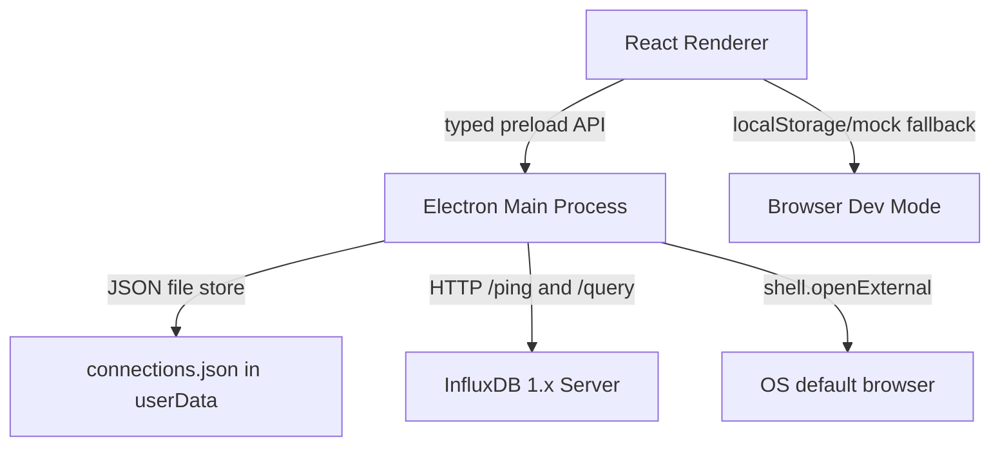
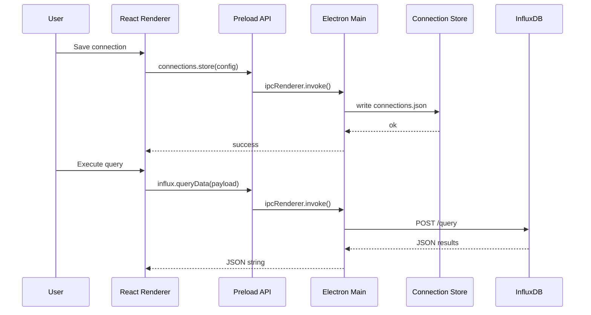

# InfluxDB UI Architecture

> Updated: 2026-03-27 | Status: Electron runtime active

## Overview

| Item | Detail |
|------|--------|
| Product | InfluxDB 1.x desktop client |
| Runtime | Electron 41 |
| Frontend | React 18 + TypeScript + Ant Design 5 |
| Build | Vite 6 + TypeScript |
| Persistence | Electron main process JSON store in `app.getPath('userData')` |
| InfluxDB Access | Electron main process `fetch()` to `/ping` and `/query` |

## Runtime Architecture

## Main Modules

### Renderer

- `src/App.tsx`: overall layout and connection-oriented state
- `src/components/ConnectionTree.tsx`: database and measurement browser
- `src/components/ConnectionForm.tsx`: create and test connections
- `src/services/connectionStorage.ts`: bridge to Electron preload API or browser fallback
- `src/services/influxdb.ts`: high-level query and metadata access

### Electron

- `electron/main.ts`: BrowserWindow setup and IPC registration
- `electron/preload.ts`: restricted API surface exposed to the renderer
- `electron/connectionStore.ts`: persistent connection repository
- `electron/influxHttp.ts`: InfluxDB 1.x HTTP client implementation
- `electron/assets/icons/`: runtime and packaging icon assets

## IPC Surface

The renderer only accesses the following preload methods:

- `window.electronAPI.connections.load()`
- `window.electronAPI.connections.store(config)`
- `window.electronAPI.connections.deleteConnection(id)`
- `window.electronAPI.influx.testConnection(payload)`
- `window.electronAPI.influx.queryData(payload)`
- `window.electronAPI.app.openExternal(url)`

This keeps the boundary narrower than a generic `invoke(channel, payload)` bridge.

## Data Flow

## Development Modes

### Browser Mode

- Command: `pnpm dev`
- Uses renderer-side localStorage/mock fallback
- Useful for UI-only work

### Electron Mode

- Command: `pnpm electron:dev`
- Uses preload + main-process persistence and HTTP transport
- Preferred for integration verification

## Known Gaps

- `pnpm build` still fails due to historical TypeScript errors outside the Electron migration slice
- Some advanced UI components remain present but are not yet part of the active main flow

## Historical Note

The repository previously used Tauri 2 + Rust. That runtime has been removed from the active codepath. Any older migration analysis should be treated as historical context, not current implementation.
